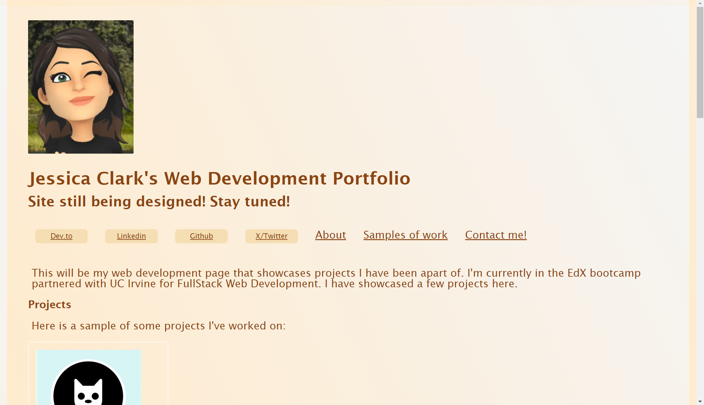

# challenge-project-second

## Description

https://jessclark1234.github.io/static-portfolio/

The purpose of this application is to show my ability to understand CSS and HTML enough to create my own webpage that showcases my work. This application will serve as a beginner website that will display my work, creativity, and abilities to future employers who are looking to hire. The design phase helped me understand the basics around a good webpage, good developer habits, and how to best structure elements in a webpage. 

## Installation

N/A

## Usage

The usage of this webpage is to showcase my portfolio and web designing abilities to potential employers and possible clients that want to use my services in the future. The usage can also be to test my abilities as a web designer and see how far I can oush myself in creating a good webpage that is eye popping and organized.

## License

MIT License

Copyright (c) 2023 jessclark1234

Permission is hereby granted, free of charge, to any person obtaining a copy
of this software and associated documentation files (the "Software"), to deal
in the Software without restriction, including without limitation the rights
to use, copy, modify, merge, publish, distribute, sublicense, and/or sell
copies of the Software, and to permit persons to whom the Software is
furnished to do so, subject to the following conditions:

The above copyright notice and this permission notice shall be included in all
copies or substantial portions of the Software.

THE SOFTWARE IS PROVIDED "AS IS", WITHOUT WARRANTY OF ANY KIND, EXPRESS OR
IMPLIED, INCLUDING BUT NOT LIMITED TO THE WARRANTIES OF MERCHANTABILITY,
FITNESS FOR A PARTICULAR PURPOSE AND NONINFRINGEMENT. IN NO EVENT SHALL THE
AUTHORS OR COPYRIGHT HOLDERS BE LIABLE FOR ANY CLAIM, DAMAGES OR OTHER
LIABILITY, WHETHER IN AN ACTION OF CONTRACT, TORT OR OTHERWISE, ARISING FROM,
OUT OF OR IN CONNECTION WITH THE SOFTWARE OR THE USE OR OTHER DEALINGS IN THE
SOFTWARE.

